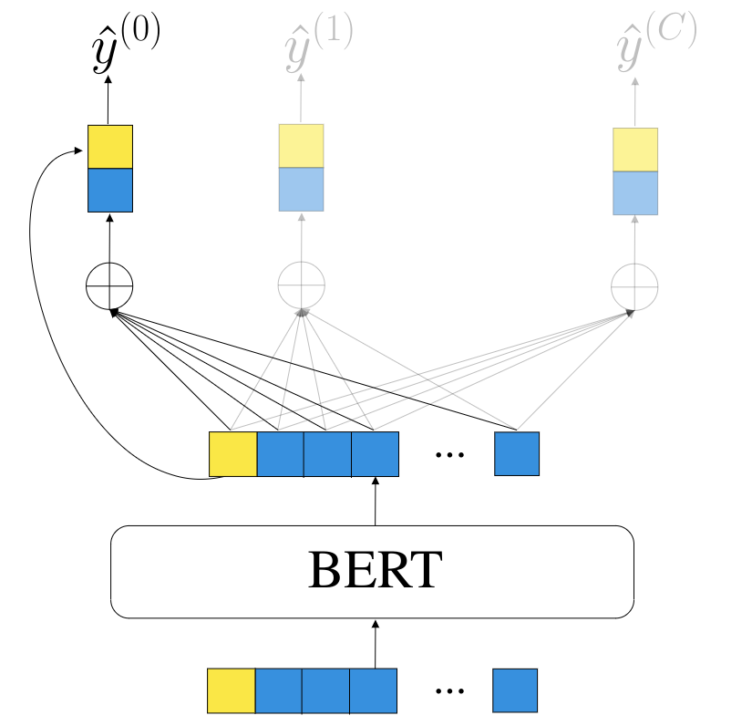

# 11-711 Advanced NLP: Group Project

## Team Members

* Ziqi Liu ([ziqil2](https://github.com/Theorem411))
* Yilin Wang ([yilinwan](https://github.com/TonyW42))
* Ethan Wu ([yongyiw](https://github.com/yongyi-wu))


## Fine-Grained Emotions

### Reproduction

So far, `GoEmotions` is the largest manually anotated dataset for fine-grained emotion classification. We successfully reproduced the results (see below) of finetuning the baseline model [`Cased BERT-Base`](https://huggingface.co/bert-base-cased) on multilable classification tasks (Section 5), each of which is based on GoEmotions taxonomy, sentiment-grouped data or Ekman's taxonomy. 

|| Macro Precision | Macro Recall | Macro F1 | 
--- | --- | --- | --- 
GoEmotions Taxonomy | 0.49 | 0.51 | 0.49
Sentiment-grouped Data | 0.64 | 0.72 | 0.68
Ekman's Taxonomy | 0.58 | 0.66 | 0.62


Moreover, this dataset shows great generalizability to other domains, as illustrated in 9 transfer learning tasks (Section 6 and Appendix H). Unfortunately, the authors did not give details nor code on data preprocessing and performance evaluation, so our re-implementation may not capture every nuance. Despite such ambiguities, our reproduced results on these datasets do reflect the overall trend as observed in the paper. 

The summary statistics for reproduced experiments are available at [`goemotions/results`](goemotions/results) directory as individual json files. To reproduce the experiment, execute the scripts below. 

```bash
cd goemotions
./setup.sh
./reproduce.sh
```

> Note: The reproduction can be completed on a single 16GB GPU in 7 hours. Due to time and computation constraints, however, the script does not perform 10 different random splits as the authors have done. 


### Improvement

We introduce a label-aware attention mechanism to perform different aggregation of last hidden states with respect to different emotion labels. We use the class-balanced (CB) loss introduced by Cui et al., with hyperparameter beta=0.95. Our model outperforms the baseline while maintaining simple design ideas and robustness to different initializations. 

<center>
    
</center>

|| Macro Precision (std) | Macro Recall (std) | Macro F1 (std) | 
--- | --- | --- | --- 
Baseline | 0.40 (0.18) | 0.63 (0.24) | 0.46 (0.19)
Ours | 0.5 (0.02) | 0.56 (0.01) | 0.52 (0.01)


To train our proposed model, execute following commands. More details to run experiment and perform analysis can be found in [experiment/README.md](experiment/README.md). 

```bash
cd experiment
conda env create -f environment.yml
conda activate exp
python classifier.py <exp_name>
```


### Related Work

* [GoEmotions: A Dataset of Fine-Grained Emotions](https://arxiv.org/abs/2005.00547)
* [An Analysis of Annotated Corpora for Emotion Classification in Text](https://aclanthology.org/C18-1179)
* [AttentionXML: Label Tree-based Attention-Aware Deep Model for High-Performance Extreme Multi-Label Text Classification](https://arxiv.org/abs/1811.01727)
* [Class-Balanced Loss Based on Effective Number of Samples](https://arxiv.org/pdf/1901.05555.pdf)


## ~~Semantic Textual Similarity (CANCELED)~~

Semantic Textual Similarity measures the degree to which two sentences are semantically equivalent. Although published in 2019, XLNet remains as a [champion](https://paperswithcode.com/sota/semantic-textual-similarity-on-senteval) on the Semantic Textual Similarity Benchmark (STS-B), a task from the well-known GLUE benchmark. 

Here, we reproduce the Pearson correlation score reported in the XLNet paper by finetuning the pretrained `XLNet-Large` on the SST-B dataset. The command-line output has been written to `xlnet/reproduce.txt`. 

### Usage

```bash
cd xlnet
./setup.sh
./reproduce.sh
```

> Note: To succeed in the finetuning stage, make sure to have acess to 4 GPUs with at least 16GB memory each. 

### Related Work

* [XLNet: Generalized Autoregressive Pretraining for Language Understanding](https://arxiv.org/abs/1906.08237)
* [SemEval-2017 Task 1: Semantic Textual Similarity - Multilingual and Cross-lingual Focused Evaluation](https://arxiv.org/abs/1708.00055)


## ~~Multi-hop Question Answering (CANCELED)~~

We reproduce the DecompRC model's result on the HotpotQA dataset. After the successful reproduction, however, we realized that the model was no longer state-of-the-art. Also, the multi-hop QA task is intrinsically difficult. Considering time and resource constraints, we decided to abandon this project topic. With that, the command-line output during the reproduction has been saved and is available at `DecompRC/reproduce.txt`. 

### Usage

```bash
cd DecompRC
./setup.sh
./reproduce.sh
```
> Note: The reproduction is especially time- and space-consuming. Ensure to have 64GB RAM and 16 hours. Nonetheless, only 1 GPU with at least 6GB memory is needed. 

### Related Work

* [Unsupervised Question Decomposition for Question Answering](https://arxiv.org/abs/2002.09758)
* [HotpotQA: A Dataset for Diverse, Explainable Multi-hop Question Answering](https://arxiv.org/pdf/1809.09600.pdf)
